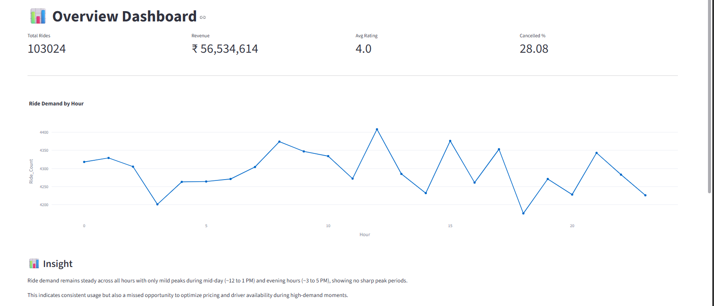
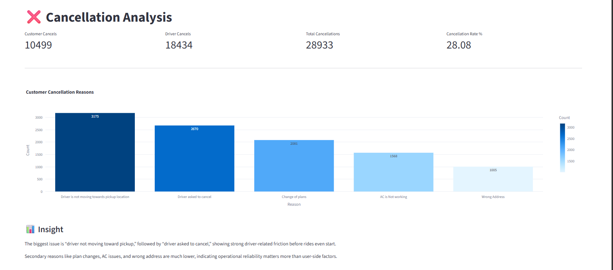
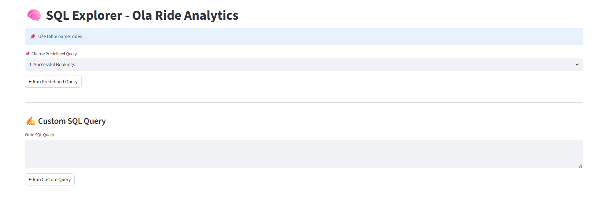

# 🚖 Ola Ride Insights Dashboard

## 📊 Project Overview

This project analyzes Ola ride-sharing data to generate actionable business insights across demand, cancellations, revenue, and user experience. It combines SQL-based analysis with an interactive Streamlit dashboard to deliver a comprehensive view of platform performance.

---

## 🚀 Live App

https://ola-ride-insights-helztsp8gqxnf4sv26kh6m.streamlit.app/

---

## 📂 Dashboard Sections

* **Overview**
  Displays key KPIs such as total rides, success rate, and ride volume trends to provide a quick snapshot of overall performance.

* **Vehicle Analysis**
  Analyzes ride distribution and usage patterns across different vehicle categories.

* **Revenue**
  Highlights earnings trends, fare distribution, and preferred payment methods.

* **Cancellations**
  Breaks down booking outcomes, including driver cancellations, customer cancellations, and unfulfilled rides.

* **Ratings**
  Compares customer and driver ratings across vehicle types to evaluate service quality.

* **SQL Explorer**
  Includes predefined SQL queries based on key business problems, along with the ability to run custom queries for deeper analysis.

* **Power BI**
  Showcases additional insights through Power BI dashboard screenshots.

---

## 📌 Features

* Interactive and user-friendly dashboard
* End-to-end data analysis using SQL and Python
* Business-focused KPIs and insights
* Custom and predefined SQL query exploration
* Integrated visualization using Streamlit and Power BI

---

## 🛠 Tech Stack

* **Python** (Pandas, Plotly)
* **Streamlit** (Dashboard development)
* **SQL** (Data analysis & querying)
* **Power BI** (Visualization - screenshots)

---

## 📷 Dashboard Preview

### Overview

### Cancellations Analysis

### SQL Explorer

---

## 📈 Key Insights

* Ride demand remains stable with predictable daily variations
* ~62% of bookings are successfully completed
* Driver-related issues are the leading cause of failed bookings
* Ratings are consistently high across all vehicle categories
* UPI is the most preferred payment method

---

## ⚠️ Notes

* Power BI dashboards are included as screenshots due to the absence of a work account for embedding reports
* SQL Explorer supports both predefined business queries and custom query execution

---

## 👩‍💻 Author

**Khyathi**
